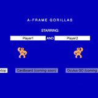
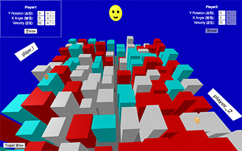

# gorilla.bas in A-FRAME
## An A-Frame re-interpretation of the QBASIC classic Gorillas from MS-DOS 5

Created by IBM (not Microsoft) in 1991 as a demonstration of QBASIC's explosive banana capabilities. This game came with every installation of MS-DOS 5.

# [Demo](https://rdub80.github.io/gorilla.bas.vr/src)
 

### Special Thanks to 

- Jeff McSpadden (jeffm@prime8.io) his musical support with the oscillator

- Brian Chirls (brian@datavized.com) his math support with parabolic curves

Challenge: https://js13kgames.com/webxr

JS version: https://tics.taxi/gorillas/

YouTube reference: https://www.youtube.com/watch?v=ncykt-YJO1M